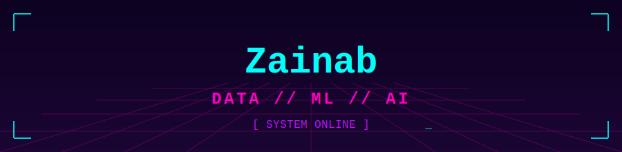

<div align="center">

<!-- flashing neon banner — lives at assets/neon_banner.svg in this repo -->



</div>

<br/>

```ansi
┌──────────────────────────────────────────────────────┐
│  SYSTEM :: IDENTITY_MODULE                            │
│  ────────────────────────────────────────────────────│
│  designation   : YOUR_NAME                            │
│  class         : Data / ML / AI Engineer              │
│  location      : sector-unknown                       │
│  status        : [ONLINE] gears turning, GPUs humming │
│  motto         : "old brass, new neurons."            │
└──────────────────────────────────────────────────────┘
```

<br/>

## ⚙️ // ABOUT.log


- 🔭 Building models in the workshop between the pistons and the pipelines
- 🧠 Neural nets by day, mechanical philosophy by night
- ⚡ Powered by caffeine, copper coils, and gradient descent
- 🛠️ Currently forging: `[ your current project ]`
- 📡 Reach me at: `[ your contact / socials ]`

<br/>

## 🔩 // TECH_STACK.dat

<div align="center">


</div>

<br/>

## 📊 // SYSTEM_METRICS

<div align="center">


</div>

<br/>

## 🗜️ // ARCHIVE.vault — Featured Builds

<table>
<tr>
<td width="50%">

### ⚙️ `project-one`
> Brief description of the project — what gear it turns, what problem it solves.

`Python` `PyTorch` `Docker`
[](https://github.com/)

</td>
<td width="50%">

### 🔮 `project-two`
> Brief description — the neon-lit twin to the brass machine above.

`Pandas` `scikit-learn` `SQL`
[](https://github.com/)

</td>
</tr>
</table>

<br/>

## 📡 // TRANSMIT_LINKS

<div align="center">

[](https://linkedin.com/in/)
[](https://twitter.com/)
[](mailto:you@example.com)
[](https://kaggle.com/)

</div>

<br/>

<div align="center">


`// end of transmission — gears still spinning`

</div>
